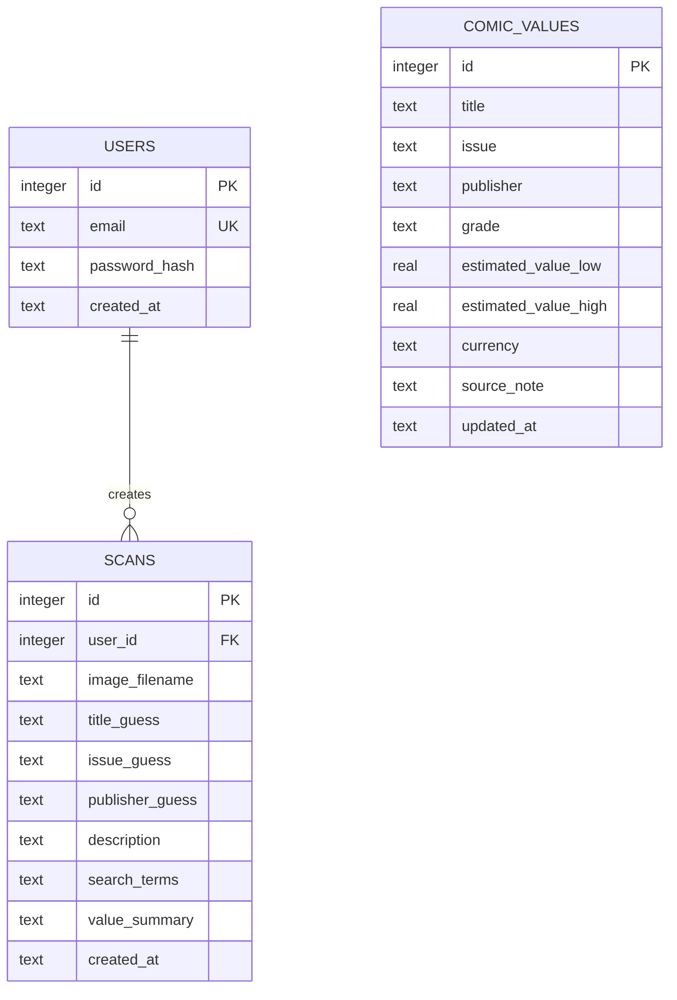

# ComicVault Database ERD and Backend Explanation

## ERD Diagram



## Database Overview

The backend uses SQLite, which stores the app data in a local file named `comic_app.db`. The database is initialized in `app.py` by the `init_db()` function. When the app starts, it creates the required tables if they do not already exist.

There are three main tables:

## `users`

The `users` table stores account information.

- `id`: the primary key for each user.
- `email`: the user's login email. It must be unique.
- `password_hash`: the securely hashed password.
- `created_at`: the timestamp for when the account was created.

The app does not store the user's real password. It stores a password hash instead.

## `scans`

The `scans` table stores the results of each comic book image upload.

- `id`: the primary key for each scan.
- `user_id`: a foreign key that connects the scan to the user who uploaded it.
- `image_filename`: the saved uploaded image filename.
- `title_guess`: the title identified by the OpenAI API.
- `issue_guess`: the issue number identified by the OpenAI API.
- `publisher_guess`: the publisher identified by the OpenAI API.
- `description`: the readable comic book description returned by the AI.
- `search_terms`: search keywords returned by the AI, stored as JSON text.
- `value_summary`: the app's valuation result.
- `created_at`: the timestamp for when the scan was created.

The relationship is one-to-many: one user can have many scans, but each scan belongs to one user.

## `comic_values`

The `comic_values` table stores comic book value reference data.

- `id`: the primary key for each value record.
- `title`: comic book title.
- `issue`: issue number.
- `publisher`: comic publisher.
- `grade`: condition or grading label.
- `estimated_value_low`: low estimated value.
- `estimated_value_high`: high estimated value.
- `currency`: currency code, such as USD.
- `source_note`: note about where the value came from.
- `updated_at`: when the value record was last updated.

Right now this table is seeded with demo data in `seed_values()`. The app uses `find_value_match()` to compare the AI's guessed title and issue number against this local table.

## How Registration Works

When a user creates an account:

1. The user submits an email and password on the registration page.
2. The backend checks that both fields are present.
3. The password is passed into Werkzeug's `generate_password_hash()` function.
4. The app saves the email, password hash, and creation timestamp in the `users` table.
5. The app stores the new user's `id` in the Flask session.
6. The user is redirected to the dashboard.

The important security point is that the original password is never saved in the database.

## How Login Works

When a user logs in:

1. The user submits an email and password.
2. The app looks up the user by email in the `users` table.
3. If the user exists, the app checks the submitted password using Werkzeug's `check_password_hash()`.
4. If the password matches the saved hash, the user's `id` is stored in the Flask session.
5. The user is redirected to the dashboard.

If the email does not exist or the password does not match, the app shows an invalid login message.

## How Sessions Work

The app uses Flask's built-in session system. After login or registration, this line stores the logged-in user's database id:

```python
session["user_id"] = row["id"]
```

On every request, `load_logged_in_user()` checks whether `session["user_id"]` exists. If it does, the app loads that user from the database and stores it in `g.current_user`.

Protected pages use the custom `login_required` decorator. If there is no logged-in user, the app redirects the visitor to the login page.

When the user logs out, the app clears the session:

```python
session.clear()
```

That removes the saved user id, so the user is no longer authenticated.

## How Upload and Scan Storage Works

When a logged-in user uploads a comic image:

1. The app validates that the file is an allowed image type.
2. The file is saved in the `uploads` folder with a unique filename.
3. The image is sent to the OpenAI API for analysis.
4. The app parses the AI response into structured fields.
5. The app searches the `comic_values` table for a matching comic title and issue.
6. The final scan result is inserted into the `scans` table with the logged-in user's id.

That is why each user's dashboard only shows that user's scans.
